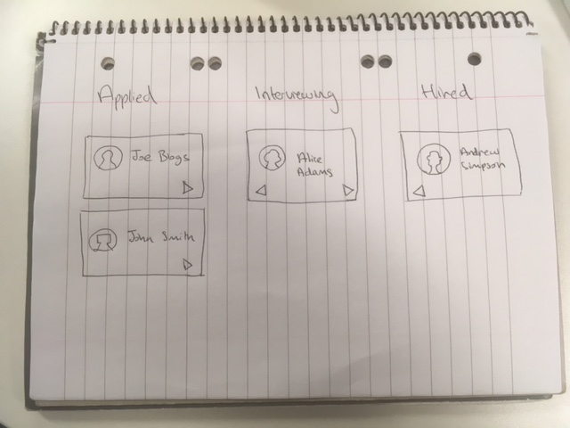

# React assignment

## Crew applications

This assignment is meant to evaluate the React proficiency of full-time engineers.
Your code structure should follow design best practices and our evaluation will focus primarily on your ability to follow good design principles and less on correctness and completeness of algorithms. During the face to face interview you will have the opportunity to explain your design choices and provide justifications for the eventually omitted parts.

### Requirements

Create a frontend React app to help with the hiring and onboarding of crew personnel as per the image below:

Prospective crew move through three stages:

- applied
- interviewing
- hired

Data sources:

- Crew personnel data: https://randomuser.me/api/?nat=gb&results=5

Try to progress as far as you can in 2 hours. If you have questions please make some assumptions and collect in writing your interpretations.

Good luck.

### Evaluation points

- use of clean code which is self documenting
- use of domain driven design
- tests for business logic
- use of code quality checkers such as linters and build tools
- use of git with appropriate commit messages
- documentation: README and inline code comments

Bonus points:

- use of docker for building and integration test

Results: please share a git repository with us containing your implementation.

**Do not mention 90 percent of everything or 90poe anywhere on the code or repository name.**
